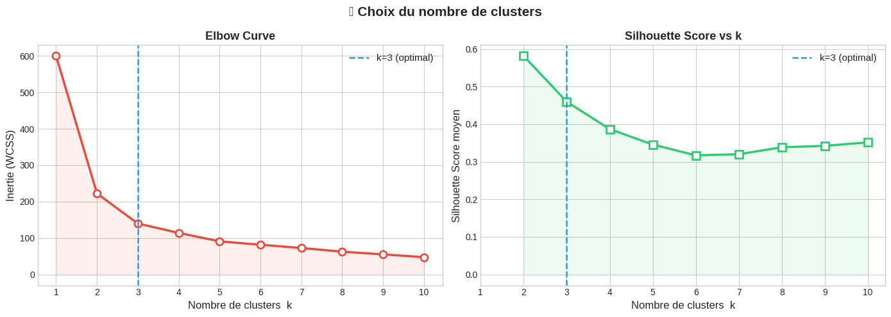
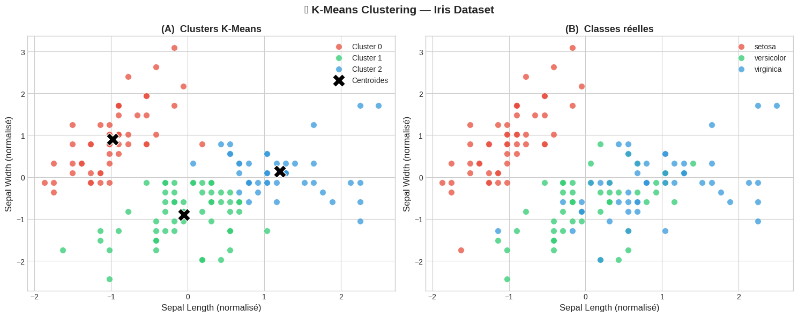
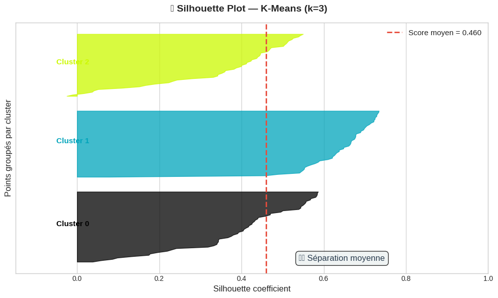

# 🌸 K-Means Clustering sur le Dataset Iris

Ce projet propose une étude complète de l'algorithme de **clustering non supervisé K-Means** appliqué au célèbre **dataset Iris**. L'objectif principal est de partitionner naturellement les données sans étiquettes et de mesurer à quel point l'algorithme parvient à retrouver la classification réelle des fleurs.

---

## 📁 Structure du Projet

```text
kmeans-iris/
├── Untitled27.ipynb         # Le notebook Jupyter contenant l'ensemble de l'analyse
├── requirements.txt         # Les dépendances Python requises pour exécuter le projet
├── elbow_silhouette.png     # Courbes d'optimisation pour le choix de K (Elbow & Silhouette)
├── clustering_result.png    # Comparaison 2D des clusters K-Means vs les vraies classes
└── silhouette_plot.png      # Analyse détaillée des coefficients de silhouette pour K = 3
```

---

## 📖 Le Dataset Iris

Le jeu de données Iris contient **150 échantillons** répartis équitablement en **3 espèces** de fleurs (50 échantillons par espèce) :
- 🌺 *Iris Setosa*
- 🌼 *Iris Versicolor*
- 🌸 *Iris Virginica*

Chaque échantillon est défini par **4 caractéristiques** (en cm) :
1. Longueur des sépales
2. Largeur des sépales
3. Longueur des pétales
4. Largeur des pétales

---

## 🛠️ Installation & Utilisation

### Prerequis
Assurez-vous d'avoir installé Python (version >= 3.8 recommandée).

### 1. Installation des Dépendances
Installez les bibliothèques requises à l'aide de la commande suivante :
```bash
pip install -r requirements.txt
```

### 2. Lancement du Notebook
Vous pouvez ouvrir et explorer le notebook Jupyter en lançant :
```bash
jupyter notebook
```
Puis ouvrez le fichier `Untitled27.ipynb`.

---

## 📈 Analyse & Visualisations Générées

### 1️⃣ Choix du Nombre de Clusters (k)
Pour déterminer le nombre optimal de clusters, deux techniques complémentaires ont été utilisées :
*   **La méthode du coude (Elbow Curve)** : observe l'évolution de la somme des carrés des distances au carré au sein des clusters (WCSS / Inertie) en fonction de $k$. Un pli marqué (coude) apparaît distinctement à $k = 3$.
*   **Le score moyen de Silhouette** : évalue la qualité de la séparation. Le score de silhouette est maximisé à $k = 2$ ($0.58$) puis à $k = 3$ ($0.46$). Compte tenu de la connaissance métier (3 espèces réelles) et de l'Elbow Curve, **$k = 3$** est retenu comme optimal.



---

### 2️⃣ Résultats du Clustering K-Means ($k=3$)
Le modèle K-Means a été entraîné sur l'ensemble des caractéristiques normalisées. Les résultats globaux obtenus sont :
*   **Inertie (WCSS)** : $139.82$
*   **Silhouette Score global** : $0.4589$ (indiquant une séparation raisonnablement bonne).

La comparaison graphique ci-dessous illustre à gauche les clusters prédits par K-Means et à droite les espèces réelles d'Iris (visualisés sur les deux premières caractéristiques : longueur et largeur des sépales) :



*Note : Les Setosa (Cluster 0) sont parfaitement isolées et identifiées. En revanche, il existe un chevauchement naturel entre les Versicolor et les Virginica au niveau des dimensions de leurs sépales.*

---

### 3️⃣ Analyse de Silhouette Détaillée
L'analyse de silhouette par échantillon permet d'analyser la cohésion au sein de chaque cluster. 
Un score proche de $1$ indique que le point est très bien classé, tandis qu'un score négatif indique qu'il est probablement dans le mauvais cluster.



*   **Cluster 0 (Setosa)** : tous les échantillons ont un score supérieur à $0.75$, ce qui montre un cluster très homogène et bien séparé.
*   **Cluster 1 (Versicolor) & Cluster 2 (Virginica)** : les profils montrent une bonne cohésion générale avec une moyenne globale de $0.459$, malgré quelques points limites proches de la frontière de décision.

---

## 📌 Conclusion
L'algorithme K-Means démontre une forte capacité à regrouper les données d'Iris de façon cohérente sans aucune étiquette préalable. Bien que les espèces *Versicolor* et *Virginica* partagent des caractéristiques morphologiques proches, la normalisation préalable des données avec `StandardScaler` et la sélection de $k=3$ permettent de capturer fidèlement la structure intrinsèque du dataset.
